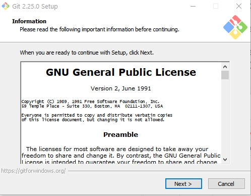
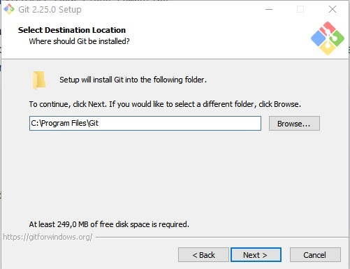
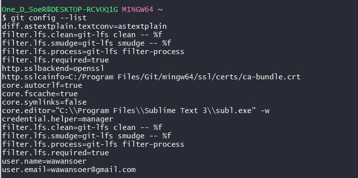
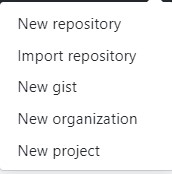
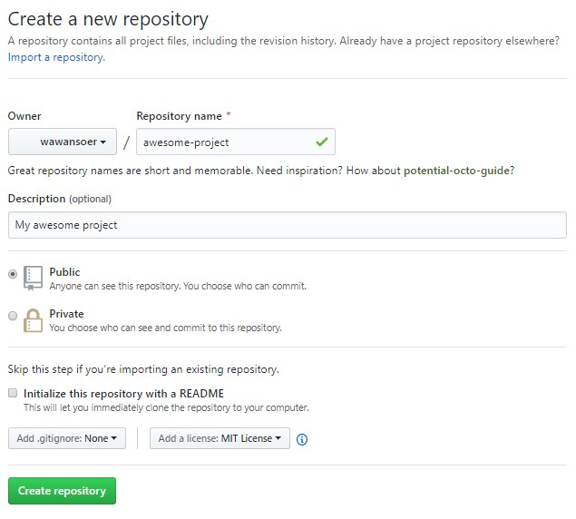

# Pertemuan Minggu Pertama Praktikum Teknologi Cloud 

## Praktik 1 : Instalasi Git

Untuk melakukan instalasi git diperlukan instaler yang dapat di download [disini](https://git-scm.com/downloads). Berikut langkah-langkah untuk melakukan instalasi git pada sistem operasi *Windows 10* 

1. Apabila sudah memiliki file instaler git maka buka berkas tersebut sehingga akan tampil informasi lisensi aplikasi git seperti pada gambar di bawah. Untuk melanjutkan instalasi cukup dengan mengklik **Next** pada layar dan untuk membatalkan klik **Cancel**. 
    

1.  Tahap selanjutnya adalah memilih lokasi direktori dimana program git akan di instal. Dalam hal ini saya menggunakan *default* direktori yang disarankan oleh aplikasi yakni pada direktori **C:\Program Files\Git**. Untuk melanjutkan instalasi cukup dengan mengklik **Next** pada layar dan untuk membatalkan klik **Cancel**.


1. Pada tahap ini merupakan tahap dimana akan dipilih komponen apa saja yang akan di instal pada aplikasi. Terdapat beberapa komponen yakni 
    - Additional Icon 
        - pada desktop 
    - bla bla 


## Praktik 2 : Konfigurasi Git
Pada tahap ini akan dilakukan konfigurasi pada PC *user* agar dapat terkoneksi dengan *git*. Setidaknya untuk konfigurasi ini dibutuhkan setidaknya *username* dan alamat email. Berikut ini adalah contoh konfigurasi awal pada git : 

1. Untuk konfigurasi *username* dan alamat email perlu digunakan sintaks seperti gambar dibawah ini. Perlu diperhatikan bahwa *username* dan alamat email harus terdaftar terlebih dahulu.  

1. Untuk mengetahui hasil konfigurasi, gunakan kode berikut: 
    ```
    $git config --list 
    ```
    setelah mengeksekusi kode diatas maka akan muncul hasil konfgurasi yang telah dilakukan seperti gambar dibawah ini : 
    
    
## Praktik 3 : Mengelola *Repository* Sendiri di Akun Pribadi
Berikut langkah-langkah yang perlu dilakukan untuk mengelola *repository* pada akun pribadi: 
1. Membuat *repository* kosong dengan menggunakan menu *New Repository* pada gambar dibawah ini : 
    
    
     
1. Setelah itu dapat dilakukan beberapa pengaturan pada *repository* seperti pada gambar dibawah ini : 
    
    pada gambar diatas dapat dilihat beberapa hal yang dapat diatur adalah 
    - nama *repository* 
    - deskripsi *repository* 
    - hak akses *repository* 
    - apabila ingin menambahkan file "Readme" pada *repository* makan centang *Initialze this repository with a README* 

1. Selanjutnya adalah melakukan *clone* 